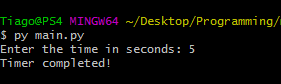

# CountDown Timer
Countdown timer made using the Python time module and is a terminal game to countdown the time.

### Prerequisites
Modules required to be able to use the script successfully
and how to install them.
Please have python3 installed to run this project on terminal:


### How to run the script
```code
python3 main.py
```
# Example

